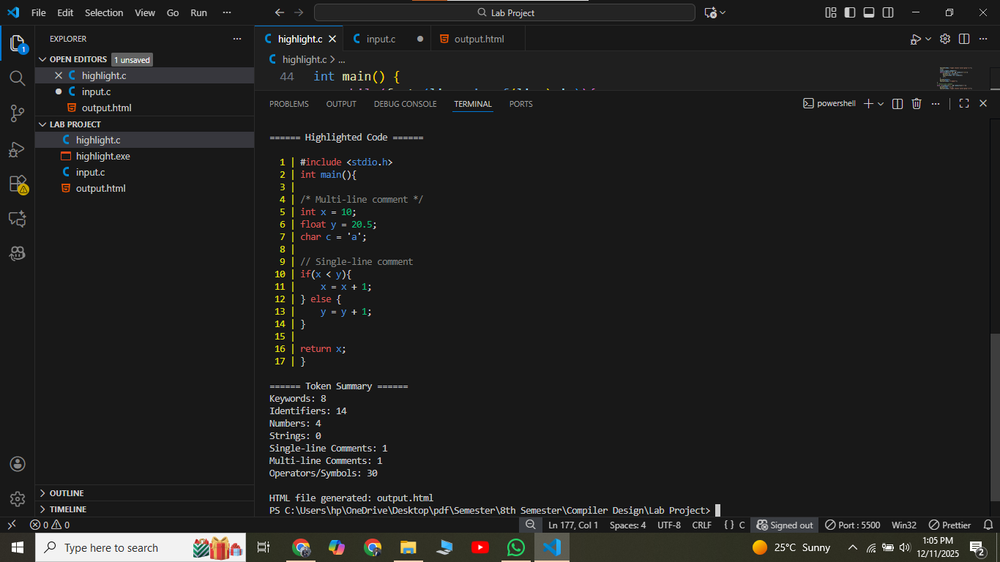
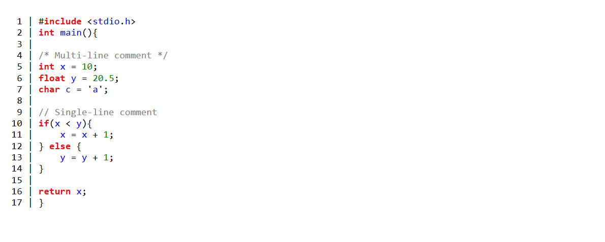

# Compiler Design Lab Project: C Code Highlighter

## Description
A C program that highlights keywords, identifiers, numbers, strings, and comments in C code.  
Generates **HTML output** and **token summary**.

## Features
- Syntax highlighting for C keywords, identifiers, numbers, strings, comments
- Line numbers in console output
- HTML file output for colored code view
- Token count summary (keywords, identifiers, numbers, comments, operators)
- Supports single-line (`//`) and multi-line (`/* ... */`) comments

## Input
- `input.c` – sample C code to highlight

## Output
- Console: colored code with line numbers
- `output.html`: HTML file with syntax highlighted code

## Token Summary Example
Keywords: 8
Identifiers: 14
Numbers: 4
Strings: 0
Single-line Comments: 1
Multi-line Comments: 1
Operators/Symbols: 30
## How to Use
1. Compile the program with `gcc highlight.c -o highlight`  
2. Run with `./highlight`  
3. Open `output.html` to see highlighted code in browser
   

## Author
Sabbir Ahmed Bappi – Daffodil International University, CSE

